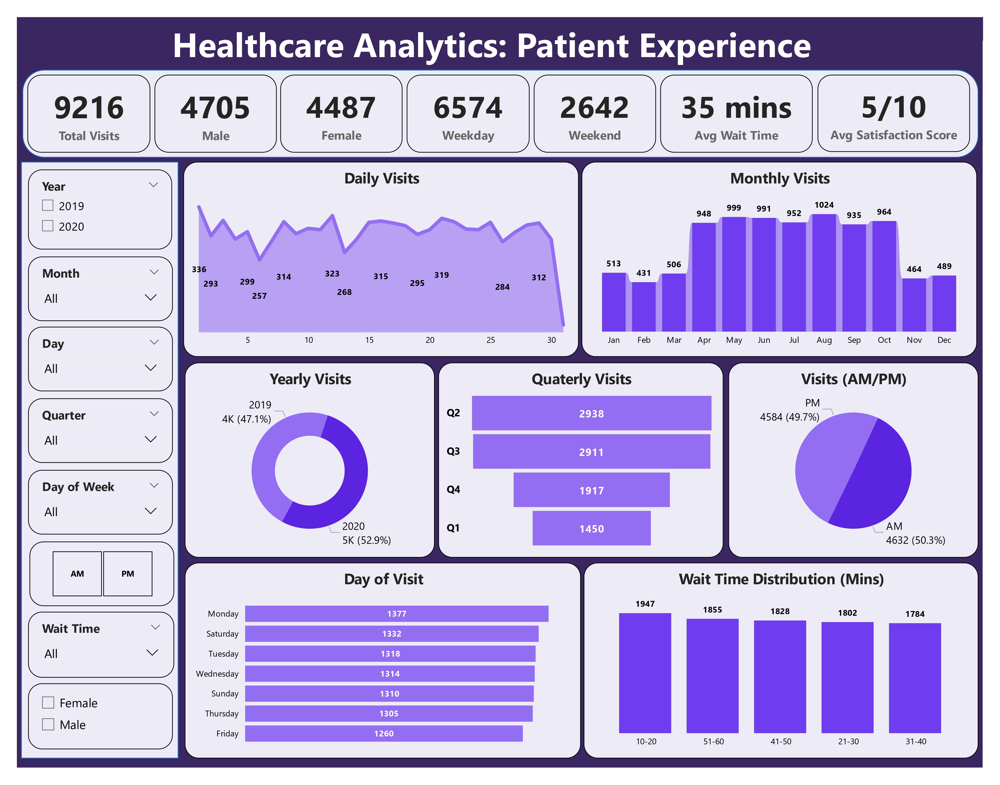
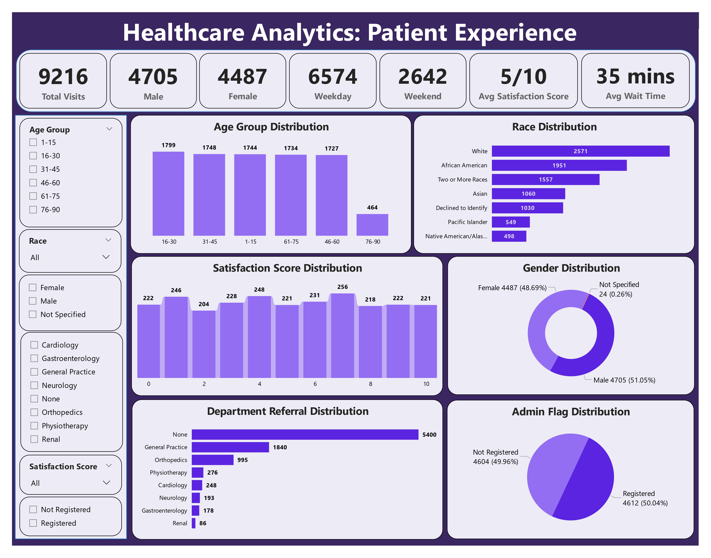

<h1 align="center">
  
   
  Healthcare Analytics: Patient Experience Insights
</h1>

  Import → Clean → Model → Analyze → Visualize   
  Power BI End-to-End Analytics on Patient Experience Data

> This project provides an end-to-end healthcare analytics solution using Power BI. Starting from raw patient data, the workflow includes **data cleaning in Power Query, data modeling into relational tables, creation of DAX measures**, and development of interactive dashboards. The analysis uncovers critical patterns in patient visits, wait times,
demographics, and satisfaction. These insights help healthcare providers optimize resource allocation, reduce patient wait times, enhance overall experience, and ultimately deliver better quality care.

## Project Workflow  
*(From Raw Data to Actionable Insights)*  

### 🩺 Data Understanding

The dataset used for this analysis was utilized to explore **patient experiences in healthcare facilities** and to gain insights that can help improve service quality. It contains key information on **patient demographics**, including age, gender, and race, **visit details** such as date, time, wait time, and department referrals, as well as **administrative information** like registration status and **patient satisfaction scores**.  

The dataset includes these fields to understand patterns in visits, evaluate service efficiency, and identify areas for improvement. For example, age and gender help analyze demographic trends, wait times show operational efficiency, and satisfaction scores reflect patient perception. Overall, this dataset provides a **comprehensive view of patient behavior and experience**, enabling meaningful analysis and actionable insights for healthcare providers.

### 📊 Step 1: Data Collection

**Source:** 📂 Public GitHub Repository (Open Dataset)

**Process Overview:**

1️⃣ **Dataset Identification:**  
- Located a **publicly available healthcare dataset** on GitHub.  
- Dataset included:  
  - 🧑‍⚕️ Patient Demographics  
  - 🕒 Visit Details (dates, times, wait times)  
  - 🏥 Healthcare Service Experience  
  - ✅ Satisfaction Scores  

2️⃣ **Data Acquisition:**  
- Downloaded dataset in **Excel (.xlsx)** format.  
- Verified structure and ensured all fields were relevant for **healthcare analytics**.  

3️⃣ **Storage & Setup:**  
- Saved dataset locally for further processing.  
- Loaded into **Power Query** for **cleaning and preprocessing** before modeling.

---

### 📊 Step 2: Data Cleaning & Preparation

**Overview:**  
Performed data cleaning and preprocessing to ensure dataset was structured, consistent, and ready for analysis.

**Key Cleaning Steps:**  
- Standardized **data types** across all columns.  
- Normalized **gender values** (M/F → Male/Female; NC → Not Specified).  
- Handled **null values** in satisfaction scores by replacing with `-1`.  
- Trimmed and cleaned **text fields** for consistency.  
- Transformed **boolean flags** (patient admin flag) into meaningful categories (Registered / Not Registered).  

**Table Preparation:**  
From the cleaned master dataset (`master_patientdata`), three structured tables were created to **organize data logically, avoid redundancy, and simplify analysis**:

1️⃣ **Patients Table**  
- Columns: `patient_id`, `gender`, `age`, `name`, `race`, `age_group` (0–90, grouped in ranges)  

2️⃣ **Visits Table**  
- Columns: `date`, `patient_id`, `satisfaction_score`, `admin_flag`, `waittime`, `department_referral`, `moment`  
- Added **waittime_group** (10–20 mins, 21–30 mins, etc.)  

3️⃣ **Date Table**  
- Removed duplicates and extracted: `year`, `month`, `month_name`, `day`, `day_name`, `quarter`  
- Added **weekday/weekend** categorization  

**Result:**  
Cleaned and structured dataset ensured **accuracy, consistency, and easy integration** into Power BI for modeling and visualization.

---

### 📊 Step 3: Data Modeling

The cleaned dataset was structured into **three main tables** to support efficient analysis and visualization:

#### 1️⃣ Patients Table
- **Fields:** `patient_id`, `name`, `gender`, `age`, `race`, `age_group`  
- **Purpose:** Captures patient demographics and enables insights by gender, age, and race.

#### 2️⃣ Visits Table
- **Fields:** `date`, `patient_id`, `satisfaction_score`, `admin_flag`, `wait_time`, `department_referral`, `moment`, `wait_time_group`  
- **Purpose:** Analyzes visit patterns, satisfaction, and service efficiency.

#### 3️⃣ Date Table
- **Fields:** `date`, `year`, `month`, `month_name`, `day`, `day_name`, `quarter`, `weekday/weekend`  
- **Purpose:** Enables time-based analysis like daily, monthly, quarterly trends, and weekday vs weekend insights.

#### Relationships
- **Patients → Visits** : One-to-Many (`patient_id`)  
- **Date → Visits** : One-to-Many (`date`)  

> These relationships ensure accurate aggregations for KPIs like total visits, average wait time, and satisfaction scores across demographics and time periods.

---

### 📊 Step 4: Data Analysis & Visualization

After cleaning and modeling the data, interactive dashboards were built in **Power BI** to uncover insights into patient visits, wait times, and overall experience.  
All **KPIs and measures** were calculated using **DAX (Data Analysis Expressions)** for accuracy and flexibility.

#### ✅ Key KPIs (via DAX)
- **Total Visits**  
- **Male Patients**  
- **Female Patients**  
- **Weekday Visits**  
- **Weekend Visits**  
- **Average Wait Time**  
- **Average Satisfaction Score**

#### Dashboard 1: Patient Visit & Time Analytics

This page focuses on analyzing patient flow, time-based patterns, and wait times.  
**Slicers:** Year, Month, Day, Quarter, Day of Week, Moment (AM/PM), Wait Time, Gender  

**Visuals & Charts:**
- **Daily Visits** → *Stacked Area Chart*  
- **Monthly Visits** → *Stacked Column Chart*  
- **Yearly Visits** → *Donut Chart*  
- **Quarterly Visits** → *Funnel Chart*  
- **Visits by AM/PM** → *Pie Chart*  
- **Day of Visit** → *Clustered Bar Chart*  
- **Wait Time Distribution (Minutes)** → *Clustered Column Chart*  

#### Dashboard 2: Patient Profile & Experience

This page highlights patient demographics and satisfaction levels.  
**Slicers:** Age Group, Race, Gender, Department Referral, Satisfaction Score, Admin Flag  

**Visuals & Charts:**
- **Age Group Distribution** → *Stacked Column Chart*  
- **Race Distribution** → *Clustered Bar Chart*  
- **Satisfaction Score Distribution** → *Stacked Column Chart*  
- **Gender Distribution** → *Donut Chart*  
- **Department Referral Distribution** → *Clustered Bar Chart*  
- **Admin Flag Distribution** → *Pie Chart*  

> Both dashboards together provide a **360° view of patient healthcare experience**, from visit trends and wait times to demographic insights and satisfaction levels.

## Data-Driven Insights

### General Overview
- **Total Visits:** 9,216  
- **Gender Distribution:** Male – 4,705 | Female – 4,487 (Balanced distribution showing equal healthcare access across genders)  
- **Visit Type:** Weekday – 6,574 | Weekend – 2,642 (Most patients prefer weekdays, possibly due to regular scheduling and hospital availability)  
- **Average Wait Time:** 35 minutes (Indicates moderate congestion in patient handling)  
- **Average Satisfaction Score:** 5/10 (Neutral score suggesting significant room for improvement in service quality)  

### Visits Analysis
- **Daily Visits:** Ranged between 250–336 visits per day. Spikes on **1st, 8th, 12th, 16th, 21st** – likely due to start/mid-month checkups or scheduled follow-ups.  
- **Monthly Visits:**  
  - Highest in **August (1,024)** and **May (999)** → could be linked to seasonal illnesses, weather changes, or annual checkups.  
  - Lowest in **February (431)** → fewer days + reduced patient activity post-holiday season.  
- **Yearly Visits:**  
  - 2019 → ~4K visits  
  - 2020 → ~5K visits → indicates growth in patient load or better data capture.  
- **Quarterly Visits:**  
  - Q2 (2,938) and Q3 (2,911) saw the most visits → possible link with summer illnesses, allergies, or increased elective procedures.  
- **AM vs PM:** Almost equal split (AM – 4,632 | PM – 4,584) → reflects steady patient flow throughout the day.  
- **Day of Visit:**  
  - Highest on **Monday (1,377)** – post-weekend backlog.  
  - Lowest on **Friday (1,260)** – patients avoid end-of-week appointments.  

### Wait Time Distribution
- Most patients wait between **10–60 minutes**, with the **highest cluster at 51–60 mins (1,855)**.  
- This indicates **capacity constraints** in peak hours and the need for better scheduling or staffing.  

### Demographics Analysis
- **Age Groups:**  
  - Majority between **16–45 years (3,547 combined)** → working-age individuals forming the largest healthcare demand group.  
  - Seniors (61–75 years → 1,734) also show a significant share, reflecting chronic condition follow-ups.  
  - **Children (1–15 years → 1,744)** highlight pediatric service utilization.  
- **Race Distribution:**  
  - White (2,571) and African American (1,951) make up the majority.  
  - Diversity observed with Asian (1,060), Native American (498), Pacific Islander (549).  
  - **Declined to identify (1,030)** → suggests data collection improvement opportunities.  

### Satisfaction Analysis
- Scores are widely distributed.  
- **Major cluster around mid-range (4–7)** → reflects neutral to moderate satisfaction.  
- **Low scores (0–3)** still significant, indicating dissatisfaction in service quality, long wait times, or facility management issues.  
- Equal distribution of high scores (8–10) suggests **mixed patient experiences**.  

### Department Referrals
- **None (5,400)** → Most patients treated in general without specialist referrals.  
- **General Practice (1,840)** → Core department.  
- **Orthopedics (995)** → High, reflecting injuries or age-related issues.  
- **Physiotherapy, Cardiology, Neurology** also notable → showing demand for specialized care.  
- **Renal (86)** → Least referrals, indicating smaller patient group.  

### Admin Flag Distribution
- **Registered (4,612) vs Not Registered (4,604)** → Balanced split, meaning patient onboarding systems are still improving.  

## Summary of Insights
- Patient flow is **steady across weekdays** but drops on weekends.  
- **Seasonal spikes** in summer months indicate predictable illness trends.  
- **Wait times need urgent optimization** – clustering near 1 hour impacts satisfaction.  
- **Neutral satisfaction levels** reflect opportunities to improve service efficiency.  
- Strong **referral flow to Orthopedics and General Practice** → these should be prioritized for resources.  
- Balanced **gender and race distribution** makes dataset ideal for inclusive healthcare insights.  

